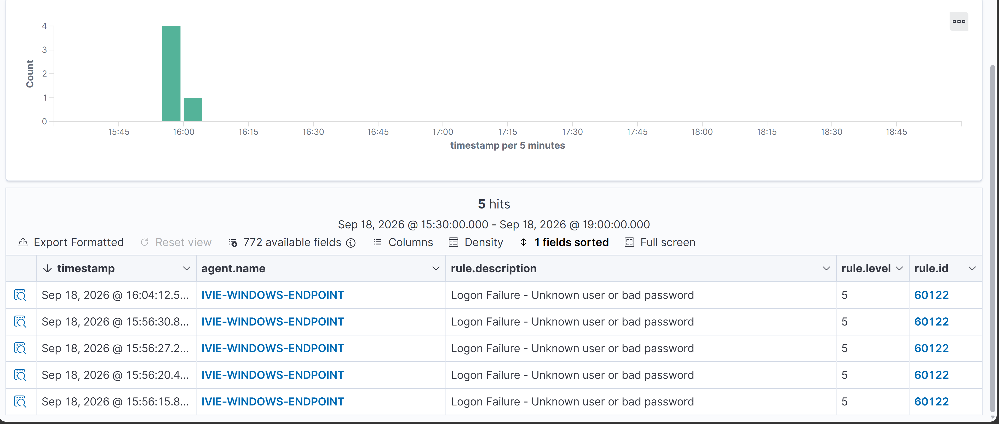
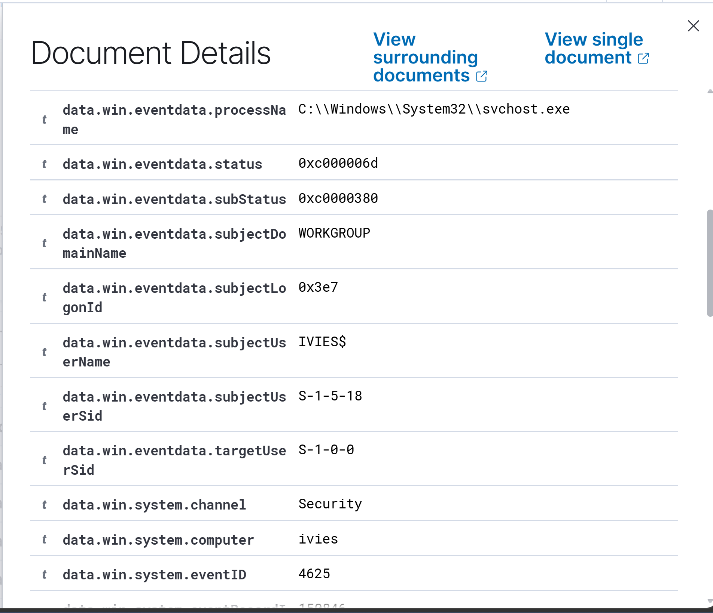
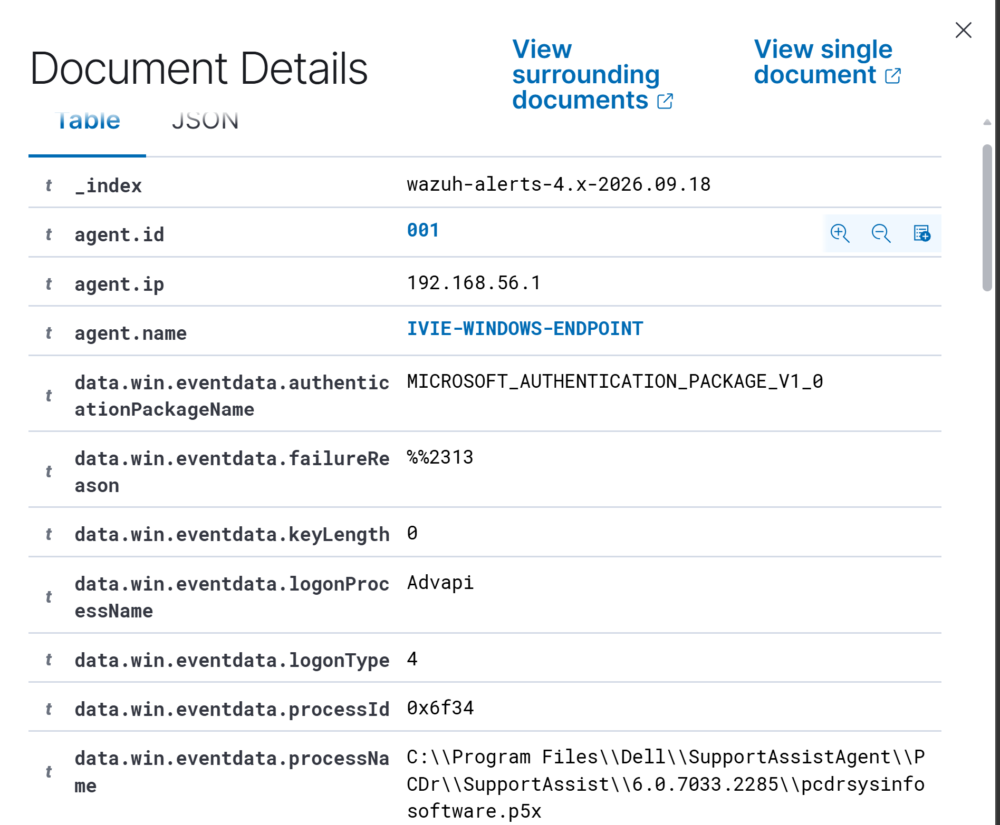
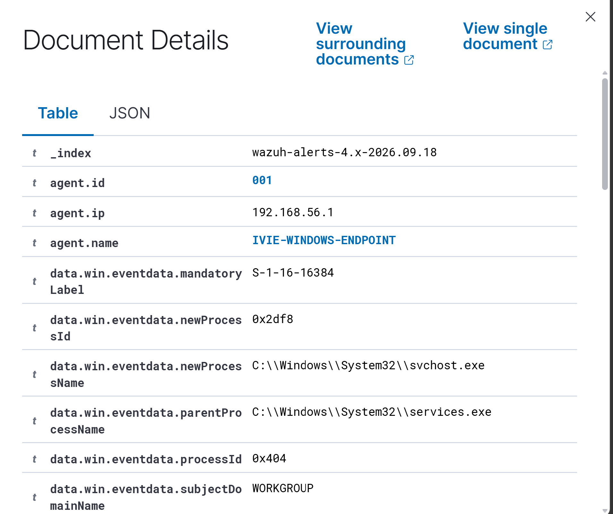
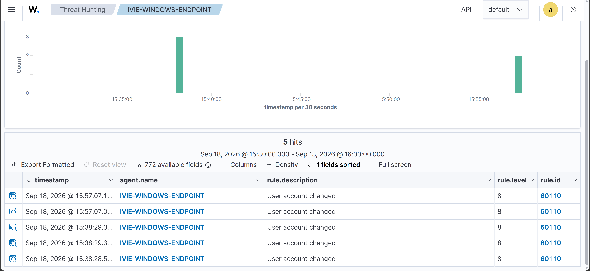

# Windows Failed Logon & Account Activity Investigation

## SOC Incident Investigation | SOC-IR-002

### Overview

This project documents a SOC investigation into a cluster of failed Windows authentication events detected on a monitored endpoint using Wazuh SIEM.

The investigation began with multiple Windows Security Event ID 4625 events occurring within a short time window. Rather than treating every failed authentication event as malicious, the activity was investigated by correlating authentication failures with process creation and account-management telemetry.

The investigation included analysis of:

- Windows Event ID 4625 — Failed logon
- Windows Event ID 4688 — Process creation
- Windows Event ID 4738 — User account changed
- Authentication source and logon type
- Account lockout activity
- Account creation and privileged-group modification activity
- Processes occurring around the authentication timeline

### Investigation Objective

Determine whether the observed authentication failures represented a brute-force attempt, successful account compromise, or other suspicious activity, and identify any evidence of subsequent account manipulation or malicious process execution.

## Lab Environment

| Component | Details |
|---|---|
| SIEM | Wazuh |
| Endpoint | Windows 11 |
| Wazuh Agent | IVIE-WINDOWS-ENDPOINT |
| Log Source | Windows Security Event Log |
| Environment | Controlled home SOC lab |
| Investigation Type | Authentication and account activity investigation |

## Incident Timeline

During threat hunting, multiple Windows failed-logon events were identified and correlated with surrounding endpoint activity.

| Time (Sep 18, 2026) | Event | Analyst Observation |
|---|---|---|
| 15:38:28–15:38:29 | Event ID 4738 | Three user-account-change events involving the `iivie` account were observed before the authentication cluster. |
| 15:56:15 | Event ID 4625 | First failed interactive logon in the observed cluster. |
| 15:56:20 | Event ID 4625 | Second failed interactive logon. |
| 15:56:27 | Event ID 4625 | Third failed interactive logon. |
| 15:56:30 | Event ID 4625 | Fourth failed interactive logon. |
| 15:57:07 | Event ID 4688 | `svchost.exe` process creation observed with `services.exe` as its parent process. |
| 15:57:07 | Event ID 4738 | Two additional account-change events involving `iivie` occurred near the authentication activity. |
| 16:04:12 | Event ID 4625 | Separate failed logon associated with Logon Type 4 and Dell SupportAssist process context. |

### Initial Hypothesis

The concentration of failed interactive logons warranted investigation for possible password guessing or unauthorized authentication activity. The investigation therefore focused on determining whether the failures originated remotely, whether authentication subsequently succeeded, and whether the activity was followed by account manipulation, privilege changes, or suspicious process execution.

## Investigation & Analysis

### 1. Failed Authentication Triage — Event ID 4625

Wazuh identified five Windows Event ID 4625 alerts within the investigation window.

Four failures formed a tight cluster:

- 15:56:15
- 15:56:20
- 15:56:27
- 15:56:30

These events were classified by Wazuh as **"Logon Failure - Unknown user or bad password."**

Detailed inspection showed:

- Logon Type: `2` (Interactive)
- IP Address: `127.0.0.1`
- IP Port: `0`
- Status: `0xC000006D`
- SubStatus: `0xC0000380`
- Process: `C:\Windows\System32\svchost.exe`
- Security log source: Windows Security

The loopback IP address did not provide evidence of a remote authentication source. Therefore, the failures were treated as suspicious authentication activity requiring correlation rather than automatically classified as a remote brute-force attack.

### 2. Separating Unrelated Authentication Activity

A fifth Event ID 4625 occurred later at approximately 16:04:12.

Inspection showed different characteristics:

- Logon Type: `4`
- Logon Process: `Advapi`
- Process associated with Dell SupportAssist

Because this event had a different logon type and application/process context from the four interactive failures, it was analyzed separately rather than included in the primary authentication cluster.

This reduced the risk of treating unrelated Windows authentication activity as a single incident.

### 3. Account Lockout Investigation

Event ID `4740` was searched to determine whether the authentication failures resulted in an account lockout.

No matching Event ID 4740 was identified within the investigated time window.

The absence of a lockout event did not prove the activity was benign, but it provided no evidence that the observed failures triggered a Windows account lockout.

### 4. Process Creation Correlation — Event ID 4688

Process-creation telemetry around the authentication window was reviewed using Event ID `4688`.

A process creation event was observed at approximately 15:57:07:

- New Process: `C:\Windows\System32\svchost.exe`
- Parent Process: `C:\Windows\System32\services.exe`

The observed parent-child relationship was not sufficient on its own to establish malicious execution. No clear evidence of suspicious command execution was identified from the reviewed process telemetry.

### 5. Account Change Investigation — Event ID 4738

Five Event ID 4738 events involving the local account `iivie` were identified.

They occurred in two clusters:

- Three events around 15:38:28–15:38:29
- Two events around 15:57:07

The later events occurred shortly after the failed-logon cluster and therefore warranted further investigation.

The target account was identified as:

- Target User: `iivie`
- Display Name: `Ivie Wilson`
- Target SID: `S-1-5-21-4155976079-569626890-2564394790-1001`

However, the available Wazuh telemetry did not expose sufficient attribute-change information to establish exactly what account property was modified or whether the 4738 events were causally related to the failed authentication activity.

The events were therefore documented as correlated account-change telemetry without attributing malicious intent.

### 6. Persistence and Privilege Checks

Additional Windows Security events were reviewed for evidence of post-authentication account manipulation.

The investigation did not identify evidence in the scoped telemetry of:

- New local account creation
- Local account lockout
- Addition of the investigated account to a privileged local group
- Clearly suspicious post-authentication process execution

These negative findings were considered alongside the authentication and account-change telemetry when determining the final incident disposition.

## Investigation Evidence

The following screenshots document the key telemetry used during the investigation.

### Evidence 1 — Failed Logon Cluster

Wazuh identified five failed-logon alerts during the investigation window. Four events occurred within approximately 15 seconds, creating the primary authentication cluster investigated in this case.

### Evidence 2 — Event ID 4625 Details

Detailed review of the failed authentication telemetry showed Windows Security Event ID 4625, including authentication status information and endpoint process context.

### Evidence 3 — Separate Logon Type 4 Activity

A separate failed authentication event showed Logon Type 4 with `Advapi` and Dell SupportAssist process context. Because its characteristics differed from the four interactive failures, it was analyzed separately from the primary cluster.

### Evidence 4 — Process Creation Correlation

Process telemetry was reviewed around the authentication timeline. The observed process creation showed `svchost.exe` launched with `services.exe` as its parent process.

### Evidence 5 — Account Change Activity

Five user-account-change events were identified for the investigated endpoint. Three occurred around 15:38 and two additional events occurred around 15:57, shortly after the failed-logon cluster.

## Incident Disposition

**Classification:** Suspicious Activity — Insufficient Evidence of Compromise

The investigation identified a short cluster of failed interactive authentication events together with nearby account-change telemetry. However, the available evidence did not establish that the activity resulted from a remote attacker or that an account was successfully compromised.

Key factors influencing the disposition included:

- Four Event ID 4625 failures occurred within approximately 15 seconds.
- The observed authentication source was `127.0.0.1`, providing no evidence of a remote source.
- A separate Logon Type 4 failure was associated with Dell SupportAssist and was not grouped with the primary interactive-logon cluster.
- No Event ID 4740 account lockout was identified during the investigated window.
- Event ID 4688 analysis identified `services.exe` spawning `svchost.exe`, but the reviewed telemetry did not establish malicious execution.
- Event ID 4738 account-change activity occurred near the authentication timeline, but the available telemetry did not establish what specific account attributes changed or prove a causal relationship with the failed logons.
- No evidence was identified in the scoped investigation of new-account creation or privileged-group modification associated with the activity.

The incident was therefore documented as suspicious authentication and account activity requiring correlation, but the available evidence was insufficient to classify it as a confirmed compromise.

## Analyst Recommendations

For a production SOC environment, the following actions would improve investigation and detection capability:

1. Continue monitoring the affected endpoint and account for additional authentication anomalies.
2. Correlate Event IDs 4625 and 4624 to determine whether repeated failures are followed by successful authentication.
3. Enrich authentication telemetry with source-host and network data where available.
4. Monitor Event IDs 4720, 4732, 4738 and 4740 for account creation, privileged-group membership changes, account modification and lockout activity.
5. Retain detailed process-creation telemetry and command-line information to strengthen post-authentication investigation.
6. Establish detection thresholds for repeated failed authentication attempts while accounting for legitimate application and service activity.

## MITRE ATT&CK Context

The investigation considered whether the authentication pattern could be consistent with credential-access or account-access techniques such as password guessing.

**T1110 — Brute Force** was considered during triage because of the clustered authentication failures. However, the available evidence was insufficient to conclude that brute force occurred.

This mapping is therefore investigative context rather than confirmation that the technique was executed.

## Skills Demonstrated

- SIEM threat hunting with Wazuh
- Windows Security Event analysis
- Authentication-event triage
- Event timeline reconstruction
- Cross-event correlation
- Windows process analysis
- Account-management event investigation
- False-positive and benign-activity differentiation
- Evidence-based incident classification
- MITRE ATT&CK contextual mapping
- SOC investigation documentation

## Tools & Technologies

`Wazuh SIEM` `Windows 11` `Windows Security Logs` `MITRE ATT&CK` `GitHub`

---

### Case Status

**SOC-IR-002 — Investigation Complete**

**Final Disposition:** Suspicious Activity — Insufficient Evidence of Compromise
